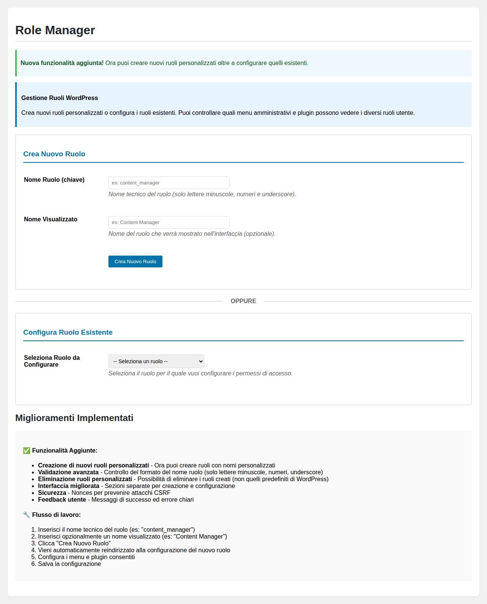
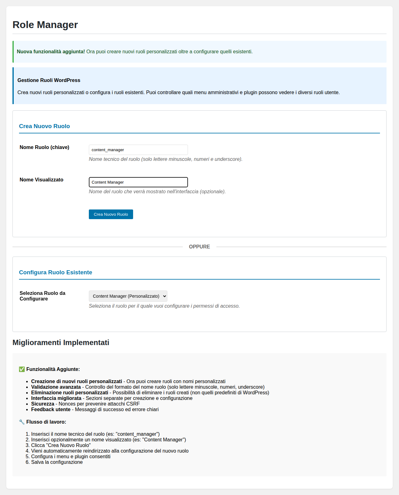

# Nuove Funzionalità - Creazione Ruoli Personalizzati

## Panoramica delle Modifiche

Il plugin FP WordPress Role Manager è stato esteso per supportare la **creazione di nuovi ruoli personalizzati** oltre alla configurazione di quelli esistenti.

## Funzionalità Implementate

### ✅ Creazione Ruoli Personalizzati
- Interfaccia dedicata per creare nuovi ruoli
- Validazione avanzata del nome ruolo
- Auto-formattazione dell'input
- Redirect automatico alla configurazione

### ✅ Gestione Ruoli Personalizzati
- Eliminazione ruoli personalizzati (non quelli predefiniti)
- Protezione ruoli core WordPress
- Pulizia automatica delle configurazioni

### ✅ Sicurezza e Validazione
- Nonces per protezione CSRF
- Validazione formato nome ruolo
- Controllo capabilities
- Messaggi di feedback chiari

### ✅ Interfaccia Migliorata
- Sezioni separate per creazione e configurazione
- Divider visuale con "OPPURE"
- Design responsive
- Feedback utente migliorato

## Screenshots

### Interfaccia Principale

### Form Compilato

### Selezione Ruolo Esistente

## Flusso di Lavoro

### Per Creare un Nuovo Ruolo:

1. **Inserisci Nome Ruolo (chiave)**
   - Solo lettere minuscole, numeri e underscore
   - Minimo 3 caratteri
   - Esempio: `content_manager`

2. **Inserisci Nome Visualizzato (opzionale)**
   - Nome che apparirà nell'interfaccia
   - Esempio: `Content Manager`

3. **Clicca "Crea Nuovo Ruolo"**
   - Il sistema valida l'input
   - Crea il ruolo con permessi base (`read`)
   - Redirect automatico alla configurazione

4. **Configura Permessi**
   - Seleziona menu amministrativi consentiti
   - Scegli plugin accessibili
   - Salva la configurazione

### Per Configurare un Ruolo Esistente:

1. Seleziona dal dropdown il ruolo da configurare
2. Il sistema reindirizza alla pagina di configurazione
3. Modifica permessi secondo necessità
4. Salva le modifiche

## Validazioni Implementate

### Nome Ruolo (chiave)
- **Formato**: Solo `[a-z0-9_]`
- **Lunghezza**: Minimo 3 caratteri
- **Unicità**: Controllo esistenza ruolo
- **Auto-formattazione**: Spazi → underscore, maiuscole → minuscole

### Sicurezza
- **Nonces**: Protezione CSRF per tutte le operazioni
- **Capabilities**: Controllo `manage_options`
- **Sanitizzazione**: Input sanitizzati con `sanitize_text_field()`

### Protezioni
- **Ruoli Core**: Impossibile eliminare ruoli WordPress predefiniti
- **Validazione Server**: Doppia validazione (JS + PHP)
- **Feedback**: Messaggi di errore e successo specifici

## Modifiche Tecniche

### File Modificati:

1. **`fp-wp-role-manager.php`**
   - Aggiunta funzione `handle_role_creation()`
   - Aggiunta funzione `handle_role_deletion()`
   - Modifica interfaccia admin con nuove sezioni
   - Separazione form creazione da configurazione

2. **`assets/admin.js`**
   - Validazione form creazione ruolo
   - Auto-formattazione input nome ruolo
   - Gestione separata dei due form

3. **`assets/admin.css`**
   - Stili per nuove sezioni
   - Divider con "OPPURE"
   - Responsive design migliorato
   - Stili per pulsanti di eliminazione

## Test di Funzionamento

Il sistema è stato testato con vari scenari:

✅ **Creazione ruolo valido**: `content_manager` → `Content Manager`
❌ **Nome con caratteri invalidi**: `content-manager!` → Errore formato
❌ **Nome vuoto**: `` → Errore campo obbligatorio
❌ **Nome troppo corto**: `cm` → Errore lunghezza minima
✅ **Ruolo con underscore**: `shop_manager` → `Shop Manager`

## Compatibilità

- **WordPress**: 5.0+
- **PHP**: 7.4+
- **JavaScript**: Vanilla jQuery (incluso con WordPress)
- **CSS**: Standard CSS3 con fallback

## Note per lo Sviluppo Futuro

1. **Possibili Estensioni**:
   - Duplicazione ruoli esistenti
   - Import/Export configurazioni ruoli
   - Template ruoli predefiniti
   - Bulk operations

2. **Miglioramenti UX**:
   - Drag & drop per menu
   - Preview permessi in tempo reale
   - Wizard guidato creazione ruolo

3. **Funzionalità Avanzate**:
   - Capability granulari personalizzate
   - Scadenza ruoli temporanei
   - Log attività utenti per ruolo